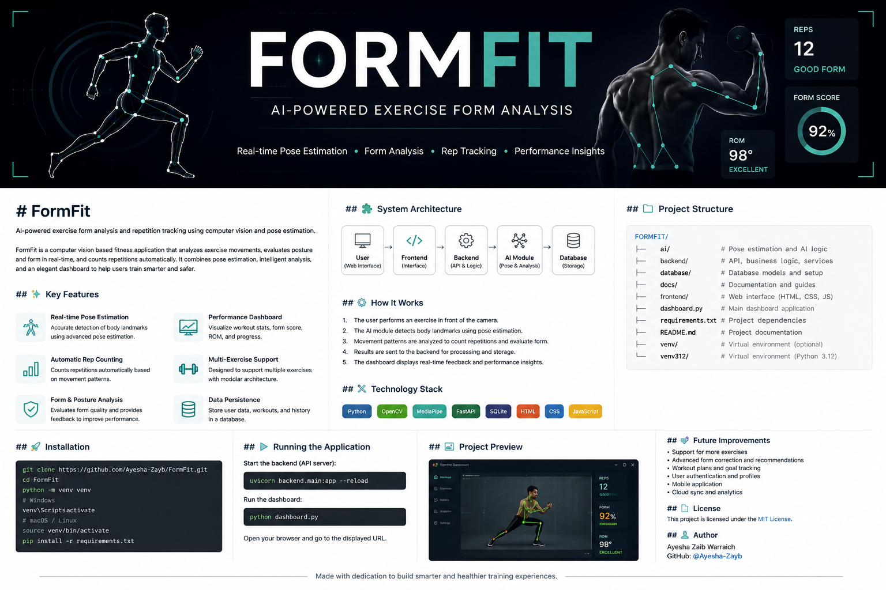

<div align="center">



# FormFit

### AI-Powered Exercise Form Analysis & Repetition Tracking

Computer vision and pose estimation for intelligent, real-time exercise analysis.

</div>

---

## About FormFit

**FormFit** is an AI-powered fitness application that uses computer vision and human pose estimation to analyze exercise movements in real time.

The system is designed to help users monitor their workouts by detecting body landmarks, analyzing movement patterns, tracking repetitions, evaluating exercise form, and presenting performance information through a dedicated dashboard.

FormFit combines **AI-based movement analysis, computer vision, backend services, database components, and a user interface** into a modular fitness application.

---

## Key Features

* **Real-Time Pose Estimation** — Detects human body landmarks during exercise.
* **Automatic Repetition Tracking** — Identifies exercise repetitions based on movement patterns.
* **Exercise Form Analysis** — Evaluates movement and posture during supported exercises.
* **Range of Motion Analysis** — Uses body-position information to analyze movement range.
* **Performance Scoring** — Provides exercise-related performance measurements.
* **Workout Dashboard** — Presents exercise results and performance information through a dedicated interface.
* **Modular Architecture** — Separates AI, backend, database, frontend, and documentation components.

---

## How It Works

FormFit follows a computer-vision-based processing pipeline:

```text
Camera Input
      │
      ▼
Pose Detection
      │
      ▼
Body Landmark Extraction
      │
      ▼
Movement & Angle Analysis
      │
      ▼
Repetition Detection
      │
      ▼
Form Evaluation
      │
      ▼
Performance Metrics
      │
      ▼
Dashboard
```

The camera captures the user's movement. Pose estimation identifies relevant body landmarks, which are then analyzed to understand movement and exercise patterns.

The resulting information is used to track repetitions and generate exercise performance insights.

---

## System Architecture

```text
                         ┌───────────────────┐
                         │       User        │
                         └─────────┬─────────┘
                                   │
                                   ▼
                         ┌───────────────────┐
                         │     Frontend      │
                         │   User Interface  │
                         └─────────┬─────────┘
                                   │
                                   ▼
                         ┌───────────────────┐
                         │      Backend      │
                         │ Application Logic │
                         └───────┬─────┬─────┘
                                 │     │
                    ┌────────────┘     └────────────┐
                    ▼                               ▼
             ┌──────────────┐               ┌──────────────┐
             │   AI / Pose  │               │   Database   │
             │    Analysis  │               │    Storage   │
             └──────────────┘               └──────────────┘
```

---

## Technology Stack

| Technology                | Purpose                                      |
| ------------------------- | -------------------------------------------- |
| **Python**                | Core application development                 |
| **OpenCV**                | Computer vision and camera processing        |
| **MediaPipe**             | Human pose estimation and landmark detection |
| **Tkinter**               | Dashboard and interface components           |
| **Backend Technologies**  | Application and service logic                |
| **Database Technologies** | Data storage and persistence                 |
| **Frontend Technologies** | User-facing interface                        |

---

## Project Structure

```text
FormFit/
│
├── ai/
│   └── AI and pose-analysis components
│
├── backend/
│   └── Backend application components
│
├── database/
│   └── Database and data-related components
│
├── docs/
│   └── Project documentation
│
├── frontend/
│   └── Frontend and interface components
│
├── dashboard.py
│   └── Dashboard application
│
├── requirements.txt
│   └── Python dependencies
│
├── README.md
│   └── Project documentation
│
└── LICENSE
    └── MIT License
```

> Local virtual environments such as `venv/` and `venv312/` should not be committed to the repository. They are local development environments and should be excluded using `.gitignore`.

---

## Installation

### 1. Clone the Repository

```bash
git clone https://github.com/Ayesha-Zayb/FormFit.git
```

### 2. Navigate to the Project

```bash
cd FormFit
```

### 3. Create a Virtual Environment

```bash
python -m venv venv
```

### 4. Activate the Environment

**Windows**

```bash
venv\Scripts\activate
```

**macOS / Linux**

```bash
source venv/bin/activate
```

### 5. Install Dependencies

```bash
pip install -r requirements.txt
```

---

## Running FormFit

Start the dashboard with:

```bash
python dashboard.py
```

Depending on the project's current configuration, additional application components may need to be started separately.

---

## Project Preview

A dedicated preview section can be used to showcase FormFit's interface, exercise analysis, and performance dashboard.

Recommended repository structure for screenshots:

```text
docs/
└── images/
    ├── formfit-dashboard.png
    └── formfit-exercise-analysis.png
```

Once project screenshots are available, they can be displayed here.

---

## Development Focus

FormFit demonstrates practical applications of:

* Computer vision
* Human pose estimation
* Real-time movement analysis
* Exercise repetition detection
* Exercise form evaluation
* Range-of-motion analysis
* Performance measurement
* Python application development
* Modular software architecture
* Fitness technology

---

## Future Improvements

Future versions of FormFit may include:

* Support for additional exercises
* More advanced form correction
* Improved repetition detection
* Personalized workout recommendations
* Workout history and progress tracking
* Expanded performance analytics
* User profiles and authentication
* Mobile application support
* Cloud-based synchronization
* Additional AI-assisted fitness features

---

## License

This project is licensed under the **MIT License**.

See the [`LICENSE`](LICENSE) file for complete license information.

---

## Author

**Ayesha Zaib Warraich**

[GitHub](https://github.com/Ayesha-Zayb)

---

<div align="center">

**FormFit**

*Intelligent exercise analysis through computer vision and pose estimation.*

</div>
